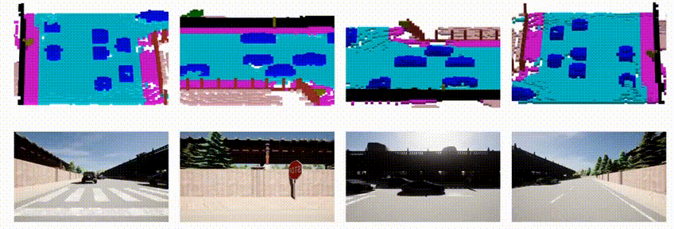
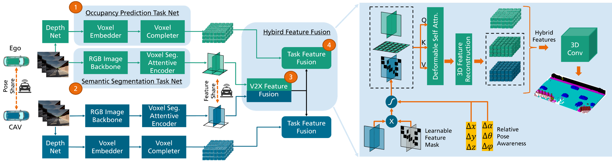

# Collaborative Semantic Occupancy Prediction with Hybrid Feature Fusion in Connected Automated Vehicles

<div align="center">

[](https://rruisong.github.io/publications/CoHFF/)
[](https://github.com/rruisong/CoHFF/assets/poster_5M.png)
[](https://arxiv.org/abs/2402.07635)
[](https://arxiv.org/pdf/2402.07635)
[](https://drive.google.com/drive/folders/1N7NaoebL8QljtRyCAL_emDsRrCwTr1iw)


</div>



## Framework Overview


## Installation
```bash
cd cohff_opv2v

# Initialize conda env
conda create -y --name cohff python=3.8
conda activate cohff
conda install pytorch==1.10.0 torchvision==0.11.0 torchaudio==0.10.0 cudatoolkit=11.3 -c pytorch -c conda-forge
conda install -c "nvidia/label/cuda-11.3.1" cuda-toolkit

# Install dependencies
python setup.py develop
```

## Dataset 
The Semantic-OPV2V dataset includes additional files for the original OPV2V data. 

### Data Introduction
We have resimulated the scenarios used in OPV2V by employing OpenCDA with additional semantic LiDARs in the CARLA simulator. You can merge the additional files into the original OPV2V data folder. This approach is consistent with other works, such as [CoBEVT](https://github.com/DerrickXuNu/CoBEVT) and [FedBEVT](https://github.com/rruisong/FedBEVT).

We made three types of dataset for Semantic-OPV2V:

- [4LidarSurround](https://drive.google.com/drive/folders/1uKo4ZtCSn50c7VAP2OT5Q1vw01Hhm01A): 4 semantic LiDARs are positioned around the ego vehicle.
- [4LidarCampos](https://drive.google.com/drive/folders/1sz6YoGht8U7CIGmJDXmQ3wM4RN_yFqJn): 4 semantic LiDARs are positioned at the original camera positions on the ego vehicle.
- [semanticlidar_18](https://drive.google.com/drive/folders/1A_DgZYewheBSXbEsEt8FMzIBfet-NaZm): 18 semantic LiDARs are positioned around the ego vehicle, offering a more complete 3D representation of the environment.


### Data Preparation

1. **Download OPV2V**: Get the OPV2V dataset from [HERE](https://mobility-lab.seas.ucla.edu/opv2v/)
2. **Integrate Semantic Data**: Merge the Semantic-OPV2V dataset with the original OPV2V dataset. The download link in Google Drive: [HERE](https://drive.google.com/drive/folders/1N7NaoebL8QljtRyCAL_emDsRrCwTr1iw)
3. **Config Dataset**: Detailed configuration of the dataset in file: `cohff_opv2v/config/train_config/opv2v_dataset.py`

## Depth Network

To train a depth estimation model, please use the depth ground truth we created for the OPV2V dataset. You can download it from: [DepthGT](https://drive.google.com/drive/folders/1hM-aCM4kW31LUAVj2b0FcIGNpXPiAVBO). We recommend using [CaDNN](https://github.com/TRAILab/CaDDN) for depth estimation.

## Quick Start

### Binary Occupancy Prediction Task

1. Navigate to the training configuration:

   `cohff_opv2v/config/train_config/task_config.yml`

2. Set the task type for occupancy prediction task:

   `task_type: 0`
   `model_type: 1`
   `supervison: 0`
   `train_dataset_dir: 'PATH/TO/TRAIN/SET'`
   `val_dataset_dir: 'PATH/TO/VALIDATION/SET'`

3. Start training:

    ```
    python main_train.py
    ```


### Training Model For Semantic Segmentation Task

1. Navigate to the training configuration:

   `cohff_opv2v/config/train_config/task_config.yml`

2. Set the task type for semantic segmentation prediction:

   `task_type: 1`
   `model_type: 2`
   `supervision: 1`
   `train_dataset_dir: 'PATH/TO/TRAIN/SET'`
   `val_dataset_dir: 'PATH/TO/VALIDATION/SET'`

3. Start training:

    ```
    python main_train.py
    ```

### Training Hybrid Feature Fusion Model with Pretrained Models.

1. Navigate to the training configuration:

   `cohff_opv2v/config/train_config/task_config.yml`

2. Set the task type for hybrid feature fusion:

   `task_type: 2`
   `model_type: 2`
   `supervision: 1`
   `segmentation_net_path: "/PATH/TO/PRETRAINED/SEGMENTATION/MODEL"`
   `completion_net_path: "/PATH/TO/COMPLETION/MODEL"`
   `train_dataset_dir: 'PATH/TO/TRAIN/SET'`
   `val_dataset_dir: 'PATH/TO/VALIDATION/SET'`

3. Start training:

    ```
    python main_train.py
    ```


### Evaluation

1. Set the path of a checkpoint in `main_eval.py`

2. Start evaluating:
        ```
        python main_eval.py --model-dir "PATH/TO/MODEL/DIR --model-name "MODEL_NAME"
        ```
3. Find the evaluation results in JSON-files in the corresponding model folder.


### Visualization


### Overview of Tunable Parameters for Configuration 

The default configuration file for the model is located at: `./config/model_config/cfg_cohff_opv2v.py `. The available parameters are detailed in a table below:

Parameter | Meaning 
---: | :---
model_type | Types of fusion model. 0: Masked semantic class based on occupancy prediction; 1: 1: Masked semantic features based on occupancy prediction; 2: concatenate occupancy and semantic features; 
task_type | Types of task for training. 0: Completion; 1: Semantic Segmentation; 2: Hybrid_Fusion 
gi | Flag of using Gauss Importance based on relative position 
supervision | Label used for supervision 0: ego gt; 1: collaborative gt 
pos_emb_type | Types of postional embeddings 1: [plane features] * [encoded rel. postion] + [encoded rel. angle] 2: [plane features] * ([encoded rel. postion] + [encoded rel. angle]) 3: [plane features] + [encoded rel. postion] + [encoded rel. angle] |cohff_opv2v/config/train_config/task_config.yml
log_freq | Number of iterations between log output 
loss_freq | Number of iterations between loss record  
save_freq | Number of epochs between saves  
vox_range | Detection range in meters  
max_connect_cav | Max number of cavs  
nbr_class | Number of semantic classes  
h | Length of voxel space 
w | Width of voxel space 
z | Height of voxel space 
segmentation_net_path | Path of pre-trained segmantation network 
completion_net_path | Path of pre-trained completion network 
train_dataset_dir| Directory of the train dataset 
val_dataset_dir| Directory of the validation dataset 
lr| Learning rate
grad_max_norm| Clip the gradients to have a maximum L2 norm of this value
weight_decay| Weight decay
optimizer_type| Optimizer type


### Acknowledgements

Our project extensively utilizes the toolchains in the OpenCDA ecosystem, including the [OpenCOOD](https://github.com/DerrickXuNu/OpenCOOD) and the [OpenCDA](https://github.com/ucla-mobility/OpenCDA) simulation tools, for developing the Semantic-OPV2V dataset.

Our project draws inspiration from a lot of awesome previous works in collaborative perception, also known as cooperative perception, such as: [DiscoNet (NeurIPS21)](https://arxiv.org/abs/2111.00643), [Where2comm (NeurIPS22)](https://arxiv.org/abs/2209.12836), [V2X-ViT (ECCV2022)](https://arxiv.org/abs/2203.10638), [CoBEVT (CoRL2022)](https://arxiv.org/abs/2207.02202), [CoCa3D (CVPR23)](https://arxiv.org/abs/2303.13560) and many others.

Additionally, our project benefits from a lot of insightful previous works in vision-based 3D semantic occupancy prediction, also known as semantic scene completion, such as: [MonoScene (CVPR22)](https://arxiv.org/abs/2112.00726), [TPVFormer (CVPR23)](https://arxiv.org/abs/2302.07817), [VoxFormer (CVPR23)](https://arxiv.org/abs/2302.12251), [FB-OCC (CVPR23)](https://arxiv.org/abs/2307.01492) and many others.


### Citation
 ```bibtex
@article{song2024collaborative,
        title={Collaborative Semantic Occupancy Prediction with Hybrid Feature Fusion in Connected Automated Vehicles},
        author={Song, Rui and Liang, Chenwei and Cao, Hu and Yan, Zhiran and Zimmer, Walter and Gross, Markus and Festag, Andreas and Knoll, Alois},
        journal={arXiv preprint arXiv:2402.07635},
        year={2024}
        }
```
Welcome to explore our new dataset for cooperative perception: [TUMTraf-V2X](https://tum-traffic-dataset.github.io/tumtraf-v2x/)
 ```bibtex
@inproceedings{zimmer2024tumtrafv2x,
  title={TUMTraf V2X Cooperative Perception Dataset},
  author={Zimmer, Walter and Wardana, Gerhard Arya and Sritharan, Suren and Zhou, Xingcheng and Song, Rui and Knoll, Alois C.},
  publisher={IEEE/CVF},
  booktitle={2024 IEEE/CVF International Conference on Computer Vision and Pattern Recognition (CVPR)},
  year={2024}
}
```
